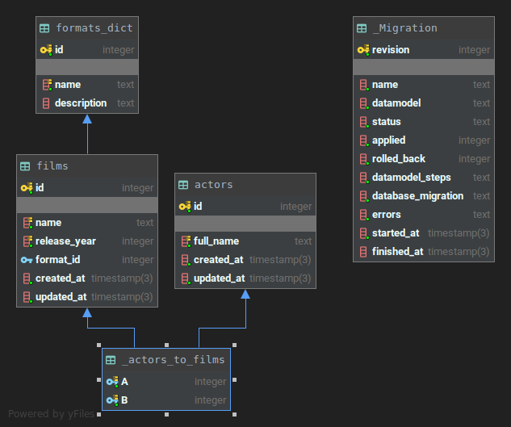

# 🎬 WBLB-FILMS-API

- [Description](#description)
- [Installation](#installation)
- [Configuration](#configuration)
- [Running the app](#running-the-app)
- [DB migrations](#db-migrations)
- [DB seeding](#db-seeding)
- [Test](#test)
- [API docs](#api-docs)
- [Database schema](#database-schema)
- [Project structure tree](#project-structure-tree)
- [Support](#support)
## Description
  
REST API for WebbyLab test project.

[Swagger docs](https://wblb-films-api.herokuapp.com/swagger) and [OpenAPI 3.0 specification](https://wblb-films-api.herokuapp.com/swagger-json).

Building with:

<p>
    <a href="http://nestjs.com/" target="blank">
       
    </a> 
    <a href="https://www.typescriptlang.org/" target="blank">
        
    </a>
    <a href="https://www.postgresql.org/" target="blank">
           
        </a>
    <a href="https://typeorm.io/" target="blank">
       
    </a>
   
 </p>

## Installation

First of all make sure you have install following software on you machine:

-   [Node.js](https://nodejs.org/) version 10+
-   [PostgreSQL](https://www.postgresql.org/) version 11+ (if you want use local database)

```bash
$ git clone git@bitbucket.org:ivashog/wblb-films-api.git
$ cd wblb-films-api
$ npm install
```

## Configuration

Before first running app configure you project environments:

-   copy `.env.example` to `development.env` (or `production.env` for production mode)
-   set up you environments variables for use app
-   run one of the following command:
-   If you want use TypeORM migrations CLI or typeorm-seeding CLI you mast create `ormconfig.js` from `ormconfig.example.js`*

```
* You can running app on new clean db in two way:
  1. Sepup envirement variable TYPEORM_MIGRATIONS_RUN = true, that automaticaly run migrations on app start
  2. Manualy run migration with `npm run migrate` command (for that you must configure `ormconfig.js` file)
```
## Running the app

```bash
# Development mode
$ npm run start

# Watch development mode
$ npm run start:dev

# Production mode
$ npm run build
$ npm run start:prod
```

more scripts view in `package.json` file.

## DB migrations

```bash

# run migration (running all migartions)
$ npm run migrate

# migration rollback (rollback only last migration!)
$ npm run migration:revert

# create new migration manually
$ npm run migration:create -- "YouMigrationName"

# generate new migration from entity changes you made
$ npm run migration:generate -- "YouMigrationName"

```

## DB seeding

```bash

# run certain seed from src/database/seeds folder
$ npm run seed -- CertainSeedClassName

```

## Test

**WIP...**

```bash
# unit tests
$ npm run test

# e2e tests
$ npm run test:e2e

# test coverage
$ npm run test:cov
```

## API docs

-   Production
    -   Swagger [https://wblb-films-api.herokuapp.com/swagger](https://wblb-films-api.herokuapp.com/swagger)
    -   OpenAPI Specification [https://wblb-films-api.herokuapp.com/swagger-json](https://wblb-films-api.herokuapp.com/swagger-json)
-   Local
    -   Swagger [http://localhost:4000/swagger](http://localhost:4000/swagger)
    -   OpenAPI Specification [http://localhost:4000/swagger-json](http://localhost:4000/swagger-json)

## Database schema:
 
 
## Project structure tree

```
    ├─ dist                         - folder with compiled *.js files (has same structure that /src)                      
    ├─ docs                         - app documents and assets
    ├─ node_modules                 - 
    ├─ src                          - main project folder fith source *.ts files
    │  ├─ config                      - project configuration files
    │  ├─ database                    - databse entities and tools
    │  |  ├─ entities                   - database models (entities) classes, that represent db tables
    │  |  └─ migrations                 - database migration classes
    │  ├─ films                       - film module files (main domain logic of this project)
    |  |  └─ dto                        - data transfer objects classes, used validation, mapping and documentation            
    |  |  films.controller.spec.ts      - controller unit tests
    |  |  films.controller.ts           - controller class with api roures declarations
    |  |  films.module.ts               - films module class
    |  |  films.service.spec.ts         - service unit tests
    |  |  films.service.ts              - films service class with methods that implement main app business logic
    |  └─ shared                      - common functions and tools that can be used in any app module
    |  ...                           ...
    │  app.module.ts                 - root app module, configure and connect all app domain modules
    │  main.ts                       - entry point of app that bootstrap app module
    └─ test                         - folder for e2e tests
    .env.example                    - example envirement configuration file
    .prettierrc                     - prettier configuration file
    nest-cli.json                   - nest-cli config
    ormconfig.example.js            - example typeorm configuration file, used for working with migrations CLI
    package.json                    - 
    README.md                       - 
    tsconfig.json                   - typescript compiler configuration
    tslint.json                     - tslint configuration

```

## Support 

Find bug? - [Report it here](https://bitbucket.org/ivashog/wblb-films-api/issues?status=new&status=open)
